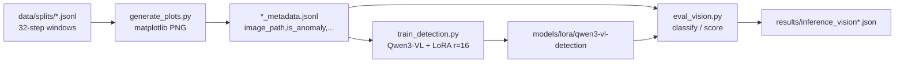

# Research: STAR-Pipeline vision/XAI showcase surface vs. FOXES ViT baseline & required techniques

**Date**: 2026-06-20 23:03:19 EDT
**Git Commit**: 6312156def73eaba5d23da0e3dbe6a3f2c42d666
**Branch**: main
**Repository**: space-telemetry-anom-llm

## Research Question

This research documents how the STAR-Pipeline repo works today and gathers the external context needed to scope a new Vision-Transformer / Explainable-AI phase reproducing **FOXES** (Goodwin et al. 2026). The eight questions, verbatim:

**Current codebase — vision & model internals**

1. In `src/training/train_detection.py` and `src/inference/eval_vision.py`, how does the current "vision" path actually work end to end — what model is loaded (Qwen3-VL via Unsloth `FastVisionModel`), what is its input (the matplotlib PNG line-plots from `src/etl/generate_plots.py`), and is any model architecture defined in-repo (custom `nn.Module`, `nn.MultiheadAttention`, ViT/patch-embedding, or `timm`/`torchvision` layers) versus loaded entirely from pretrained weights?
2. What does the image data layer look like today: how does `src/etl/generate_plots.py` render windows to PNGs, what are the image dimensions/channels (single-panel RGB line-plot vs. multi-channel scientific tensor), and what does the `*_metadata.jsonl` sidecar schema (`image_path`, `is_anomaly`, `mission`, `channel`) contain? How many plots exist per split?

**Current codebase — evaluation, MLOps & "showcase" surface**

3. How is a new modeling approach plugged into the comparison harness today? Trace how `src/inference/evaluate.py` discovers and loads each approach's result file (per-channel vs. per-window loader families), the `results/*.json` schemas it expects, the metrics it computes (`cef_from_pr`, `affinity_f1`), and the `Makefile` targets / `validate-*` gates.
4. What operational / packaging surface already exists that signals "TRL-7/8" maturity — Gradio demo, HuggingFace model cards, Kaggle notebook, provenance patterns (run `config`/`summary` snapshots, atomic checkpoint writes, `--resume`), and any API/MCP-style access? How does the project currently present competencies?
5. How are results currently visualized (matplotlib in `src/inference/pr_curve.py` and `generate_plots.py`, PR-curve/comparison-report outputs) and how does the Gradio space present model output? Document figure/plot/demo patterns relevant to rendering attention/saliency maps.

**External — the FOXES baseline & required techniques**

6. What does the FOXES paper (Goodwin et al. 2026, ApJ, DOI 10.3847/1538-4357/ae5e4a) actually specify (ViT architecture, splits, metrics, spatial attribution)? Compare to the ticket's architecture summary.
7. What are the external building blocks the role names, with concrete capabilities/interfaces: (a) Surya solar foundation model + AR segmentation masks; (b) raw attention extraction via PyTorch forward hooks + attention rollout; (c) `timm`/PyTorch ViTs for multi-channel (>3) scientific tensors?
8. What SDO/AIA EUV + GOES SXR data sources and tooling are commonly used (SunPy, JSOC/`drms`, AIA channel set, GOES/XRS retrieval, SDOML / FDL datasets), including sizes/access — versus the ESA-AD satellite-telemetry data the repo uses today?

## Research Methodology (verbatim)

This document will remain objective and factual. It does not contain any recommendations or implementation suggestions.
Open questions will not ask Why things haven't been built or what should be built in the future.

There is no "implementation" section - that is intentional.

## Summary

The STAR-Pipeline "vision" path is a **prompt-and-LoRA fine-tune of a pretrained vision-language model, not a from-scratch computer-vision model**. `src/training/train_detection.py` and `src/inference/eval_vision.py` both load `unsloth/Qwen3-VL-8B-Instruct-unsloth-bnb-4bit` via Unsloth's `FastVisionModel.from_pretrained` and apply a rank-16 LoRA adapter. A repo-wide search for `nn.Module`, `nn.MultiheadAttention`, `timm`, `patch_embed`, `ViT`, and `torchvision` returns **zero matches** anywhere in `src/` — there is no custom network, no patch-embedding code, and no attention access; the architecture is entirely pretrained weights with the repo contributing only the LoRA config and the train/inference loops. The visual input is the simplest possible scientific image: a **single-panel 800×400 RGB matplotlib line-plot** of one normalized telemetry window (32 timesteps), rendered by `src/etl/generate_plots.py` with a five-field `*_metadata.jsonl` sidecar (`index`, `image_path`, `is_anomaly`, `mission`, `channel`), 2,000 PNGs per split (train/val/test = 6,000 total).

The evaluation and "showcase" surface is comparatively mature and is the project's strongest TRL signal. `src/inference/evaluate.py` is a pure aggregator: every approach is hardcoded as a `(label, path)` pair and loaded by one of two loader families — a **per-channel** family (`_load_per_channel`, macro-averaging LSTM/Isolation-Forest channel dicts) and a **per-window** family (`_summarize_detection`, reading `summary`+`results` JSON for all LLM variants). It computes `cef_from_pr` (F-beta with β=0.5, weighting precision 4×) and `affinity_f1` (an interval-merge-and-match event metric with `gap=16`/`delta=32` tolerances), and writes `comparison_report.md` + `comparison_metrics.json`. There is **no automated test suite** anywhere in the repo; correctness is enforced by six inline-Python `validate-*` Makefile gates. Provenance is solid: every result JSON embeds a `config` snapshot (`vars(args)`), writes are atomic (temp file + `Path.replace`/`os.replace`), and every long loop supports `--resume` and `--checkpoint-every`. The packaging surface includes a Gradio HF Space (text GGUF model only, two `gr.Textbox` widgets, **no image/plot/overlay rendering**), three HF model/dataset cards with `model-index` metrics, and a Kaggle write-up notebook. Visualization conventions are consistent matplotlib (`#1f77b4` blue, `alpha=0.3` fills, `figsize=(6,5)`/`(8,4)`, `dpi=120`/`100`, Agg backend) — but **no attention or saliency rendering exists anywhere today**.

On the external side, the **FOXES paper is now published** (Goodwin et al. 2026, ApJ 1003:48, DOI 10.3847/1538-4357/ae5e4a; arXiv:2604.10835, with open code at github.com/griffin-goodwin/FOXES and weights/data on HuggingFace). FOXES = "**F**ramework for **O**perational **X**-ray **E**mission **S**ynthesis." It is a *translation/regression* model: 7-channel SDO/AIA EUV stack (94/131/171/193/211/304/335 Å, 7×512×512) → contemporaneous GOES 1–8 Å SXR flux in log-space. The ViT uses **8×8 patches (4,096 patches), embedding dim 256, 8 encoder blocks, 8 heads, MLP 1,024**, with a **per-patch linear regression head whose 4,096 scalar outputs sum to the global GOES prediction** — this is what provides intrinsic spatial attribution, augmented by **raw attention maps** (no rollout, no Grad-CAM) and a non-local **9×9 masked-attention** scheme instead of a CLS token. Splits are purely temporal (train 2012–2022, test Aug-2023–Sep-2025); the headline metric is MAE 0.051 dex (vs. 0.307 baseline). The named building blocks all exist and are accessible: Surya (IBM+NASA, 366M spatiotemporal transformer, 13-channel SDO input, AR-segmentation benchmark masks in HDF5 on HuggingFace); PyTorch attention extraction (with the critical caveat that fused/SDPA/Flash attention exposes no weights — `attn_implementation="eager"` or `timm.layers.set_fused_attn(False)` is required) plus attention rollout (Abnar & Zomorodian 2020); and `timm`'s `in_chans=N` with automatic `adapt_input_conv` repeat-and-scale weight adaptation for >3 channels. The data scale gap is stark: the repo's ESA-AD tabular benchmark is ~31 GB, SDOML is ~6.5 TB, the FOXES dataset is ~1.4 TB, and the full SDO archive is ~18–22 PB; a small representative EUV→SXR demo at SDOML resolution would be ~1–5 GB.

## Detailed Findings

### 1. The "vision" path end-to-end (Q1)

The vision path is three stages — ETL → LoRA fine-tune → inference — wrapped around a pretrained VLM.

**Model loaded.** Both entry points load the same 4-bit-quantized Qwen3-VL through Unsloth:
- `src/training/train_detection.py:28` — `DEFAULT_MODEL = "unsloth/Qwen3-VL-8B-Instruct-unsloth-bnb-4bit"`, loaded at `train_detection.py:93-97` via `FastVisionModel.from_pretrained(..., load_in_4bit=True)`.
- `src/inference/eval_vision.py:42` — `BASE_MODEL = "unsloth/Qwen3-VL-8B-Instruct-unsloth-bnb-4bit"`, loaded the same way (`eval_vision.py:137-141`), then `FastVisionModel.for_inference(model)` (`eval_vision.py:142`).

Training wraps the base in a LoRA adapter via `FastVisionModel.get_peft_model` (`train_detection.py:99-110`): `r=16`, `lora_alpha=16`, `lora_dropout=0`, `random_state=42`, with **all four module groups enabled** (`finetune_vision_layers`, `finetune_language_layers`, `finetune_attention_modules`, `finetune_mlp_modules` all `True`). The adapter is saved to `models/lora/qwen3-vl-detection/`. At inference, `--base` swaps `model_ref` to the bare HF repo so no adapter is applied (`eval_vision.py:382-383`), giving the base-vs-fine-tuned comparison.

**No in-repo architecture.** A search of all of `src/` for `nn.Module`, `MultiheadAttention`, `timm`, `patch_embed`, `ViT`, `torchvision` returns **nothing**. The only `import torch` in the vision path is inside `eval_vision.py:198` (`torch.no_grad()` and float32 cast for logit scoring). There is no custom `nn.Module`, no patch embedding, no attention hook — the model is 100% pretrained weights plus LoRA. (The only model *definition* in the repo is the Keras LSTM baseline in `src/baselines/train_lstm.py:65-79`, which is unrelated to vision and runs on a different framework.)

**How the image is consumed.** `build_conversations` (`train_detection.py:38-73`) opens each PNG with `PIL.Image.open(img_path).convert("RGB")` and builds Unsloth's chat format — a user turn containing a `{"type":"text"}` prompt plus a `{"type":"image"}` PIL object, and an assistant turn with the label string `"ANOMALY DETECTED"` / `"NOMINAL"`. The `USER_PROMPT` (`train_detection.py:32-35`) is: *"This is a plot of a spacecraft telemetry sequence (normalized value vs. timestep). Does it show anomalous behaviour? Answer with ANOMALY DETECTED or NOMINAL."* Training uses TRL's `SFTTrainer` + `UnslothVisionDataCollator` with `remove_unused_columns=False` and `skip_prepare_dataset=True` (`train_detection.py:147-148`).

Inference `classify_image` (`eval_vision.py:146-162`) builds the same structure via `processor.apply_chat_template`, then `model.generate(max_new_tokens=32, do_sample=False)`, strips the prompt tokens, and `classify_response` (`eval_vision.py:55-62`) pattern-matches `ANOMALY`/`NOMINAL`/`UNKNOWN`. A **Phase-14 continuous score** path, `score_image` (`eval_vision.py:191-234`), runs `generate(max_new_tokens=1, output_scores=True)`, reads the first-token logits for the `ANOMALY` and `NOMINAL` sub-tokens (`verdict_token_ids`, `eval_vision.py:178-188`), and computes a numerically-stable binary softmax into `results/inference_vision_scored.json`.



#### Testing patterns
No tests. There is no `tests/` dir, no `pytest`/`conftest.py` config, and no `assert`-based test of the vision path anywhere outside `.venv/`. The vision path is exercised only manually via `make eval-vision` and the `validate-*` gates on its output JSON.

### 2. The image data layer (Q2)

`src/etl/generate_plots.py` reads `data/splits/{split}.jsonl` and renders each record's `metadata["values"]` array (normalized float series, ~32 timesteps) to one PNG. Records with missing or <3-point series are skipped, not synthesized (`generate_plots.py:75-77`).

`plot_telemetry_window` (`generate_plots.py:29-48`) produces a **single-panel RGB line-plot, not a scientific multi-channel tensor**:
- `figsize=(8, 4)`, `dpi=100` → nominal 800×400 px (then `bbox_inches="tight"` trims)
- `ax.plot(x, data, linewidth=1.5, color="#1f77b4")` + `ax.fill_between(x, data, alpha=0.3, color="#1f77b4")`
- axis labels "Timestep" / "Normalized Value", light grid (`alpha=0.3`), top/right spines hidden, white background, **no title, no legend**
- backend forced to `Agg` (`generate_plots.py:23`); output to `data/processed/plots/{split}/{i:06d}.png` (`generate_plots.py:79`)

**Metadata sidecar** (`generate_plots.py:83-95`), written to `data/processed/plots/{split}_metadata.jsonl`, has exactly five fields:

```json
{"index": 0, "image_path": "data/processed/plots/train/000000.png",
 "is_anomaly": false, "mission": "ESA-Mission3", "channel": "channel_25"}
```

**Counts.** Default `--max-per-split = 2000` (`generate_plots.py:53`). All three sidecars have 2,000 lines each → **2,000 train + 2,000 val + 2,000 test = 6,000 PNGs**. (`run_base.log` at repo root is the *text* GGUF path, not vision.)

#### Testing patterns
No tests. The closest gate is `validate-etl` (`Makefile:255-267`), which checks the upstream `data/splits/*.jsonl` (30,000 total records, 3 missions) but does not check the rendered PNGs or sidecars.

### 3. The comparison/evaluation harness (Q3)

`src/inference/evaluate.py` is a **pure aggregator** — it reads persisted result files, never runs a model. There is no plugin registry or directory scan: each approach is a module-level `(NAME, PATH)` constant (`evaluate.py:28-39`) with a dedicated loader called explicitly in `main()` (`evaluate.py:823-838`). Adding an approach = declare a path, write/reuse a loader, append to the `results` list before `generate_report()`.

Two loader families divide by input schema:

| Family | Function | Approaches | Input schema | Aggregation |
|---|---|---|---|---|
| Per-channel | `_load_per_channel` (`evaluate.py:166-194`) | LSTM (`load_lstm_results`), Isolation Forest (`load_if_results`) | `{summary, config, channels[]}` with per-channel `precision/recall/f1` | macro-average across channels |
| Per-window | `_summarize_detection` (`evaluate.py:205-263`) | all LLM variants (fine-tuned, base zero/few-shot, frontier zero/few-shot, vision, vision-base) | `{summary, results[]}` with per-row `predicted/is_anomaly` | reads summary metrics directly |

Per-window loaders (`evaluate.py:266-354`) point at `inference_test.json`, `inference_base.json`, `inference_base_fewshot.json`, `inference_frontier_sample.json`, `inference_frontier_fewshot.json`, `inference_vision.json`, `inference_vision_base.json`. Special cases: `trivial_always_anomaly()` (`evaluate.py:299`) computes precision=positive-rate analytically; `derive_hybrid()` (`evaluate.py:392`) copies LSTM detection + LLM advice; `load_ensemble_results()` (`evaluate.py:341`) splices pre-computed unified dicts from `ensemble_metrics.json`.

**Result schemas.** Per-window files: top-level `summary` (`n_samples, precision, recall, f1, accuracy?, unknown_responses, avg_time_s?, partial?`) + `results[]` (`index, mission, channel, is_anomaly, predicted, actual_response`). Per-channel files add per-entry `pred_starts`/`gt_starts` arrays (LSTM only, enabling Affinity-F1). Scored files (`inference_*_scored.json`) add `score, logit_anomaly, logit_nominal, argmax` and are read only by `pr_curve.py`/`ensemble.py`.

**Metrics.**
- `cef_from_pr` — defined identically in `evaluate.py:57-67`, `pr_curve.py:41-47`, `ensemble.py:69-73`. It is F-beta: `(1+β²)·P·R / (β²·P + R)`; with β=0.5, `β²=0.25` so precision is weighted 4× (called "CEF0.5" throughout).
- `affinity_f1` (`evaluate.py:90-134`) — an interval-aware event metric. `_merge_intervals` (`evaluate.py:76-87`) merges per-window spans within `gap=16` into contiguous anomaly intervals; a predicted interval matches a GT interval when `ps ≤ ge+delta AND pe ≥ gs-delta` with `delta=32`; precision/recall/F1 are computed over matched intervals. LSTM uses `_per_channel_affinity` (`evaluate.py:140`) from stored `pred_starts`; the LLM uses `_llm_affinity` (`evaluate.py:369`) by joining `results[]` to `test_with_advice.jsonl` on `index`.

**Makefile gates.** Targets `baseline`, `baseline-if`, `eval-llm`, `eval-base[-fewshot]`, `frontier-assemble`, `eval-vision[-score]`, `vision-pr-curve`, `eval-all`, `ensemble` produce the result files; six `validate-*` gates assert correctness: `validate-baseline` (`Makefile:53-69`), `validate-format` (`76-86`), `validate-inference` (`107-127`), `validate-eval` (`210-228`), `validate-advice` (`242-253`), `validate-etl` (`255-267`). Each is an inline-Python `assert` block (e.g. all metrics finite and in `[0,1]`, no `error` key, required report sections present).

#### Testing patterns
No pytest suite. The `validate-*` Makefile one-liners *are* the test layer — single-use post-phase sanity checks, no fixtures/mocks/isolation. (`test_local_gguf.py` is an inference driver despite its `test_` prefix.)

### 4. Operational / packaging "TRL" surface (Q4)

| Artifact | Location | What it is |
|---|---|---|
| Gradio HF Space | `huggingface/space-demo/app.py`, `README.md` | 57-line `gr.Interface`; loads **text GGUF** `dyrtyData/star-pipeline-qwen3-8b-advice-gguf` via `llama_cpp` (`app.py:24-25`); two `gr.Textbox` widgets (`app.py:42-53`) |
| Text model card | `huggingface/qwen3-8b-advice-gguf_MODELCARD.md` | `model-index` metrics (F1 0.453, CEF0.5 0.392), QLoRA training details, GGUF usage |
| Vision model card | `huggingface/qwen3-vl-8b-detection_MODELCARD.md` | `pipeline_tag: image-text-to-text`; F1 0.457, P 0.769, R 0.325, CEF0.5 0.604, acc 0.806; r16 QLoRA, 2,000 PNGs, ~65 min A6000 |
| Dataset card | `huggingface/esa-ad-star-splits_DATASETCARD.md` | split table (train 21k / val 4.5k / test 4.5k), schema, `cc-by-3.0` |
| Kaggle notebook | `contributions/kaggle/star-pipeline-esa-ad.ipynb` | 6-cell write-up; one runnable Isolation-Forest cell, results tables as static markdown |
| Makefile CLI | `Makefile` | every phase as a named target |
| Contribution map | `contributions/README.md` | venue/status table |

**Provenance patterns** (the strongest maturity signal):
- **Atomic writes** — temp file + `Path.replace`/`os.replace`: `test_local_gguf.py:209-212` & `328-331`, `eval_vision.py:114-117` & `274-277`, `train_lstm.py:454-459` (`_atomic_write_json`).
- **`--resume`** — `test_local_gguf.py:355-358`, `eval_vision.py:362-363`, `train_lstm.py:424-428` (rebuilds a `done` set of `(mission, channel)`).
- **`--checkpoint-every`** (default 250) — `test_local_gguf.py:264-266`, `eval_vision.py:337-339` & `454-458`.
- **Config snapshots** — every result JSON embeds `"config": vars(args) | {...}` (`train_lstm.py:489,506`; `isolation_forest.py:125`; `tune_threshold.py:176-194`); training runs `report_to="none"` (`train_advice.py:157`), so provenance lives in the output files and the `DEFAULTS` dict (`train_advice.py:23-54`).

**No API/MCP server** exists. The only network access is the Space's `Llama.from_pretrained` HF pull and the ETL download scripts (`src/etl/download_esa.py`, `download_kaggle.py`). All scripts use a `main()` + `__main__` CLI pattern wrapped by the Makefile.

#### Testing patterns
No tests for any packaging artifact. The Space `app.py` has no test; model cards and the notebook are static docs.

### 5. Visualization & demo presentation patterns (Q5)

**PR curves** — `src/inference/pr_curve.py` produces one PNG per run (`Path(args.out).with_suffix(".png")`, `pr_curve.py:95`). Figure (`pr_curve.py:192-210`): `plt.subplots(figsize=(6,5))`, Agg backend (`:188`); PR curve `color="#1f77b4", lw=2`; random baseline `axhline(..., ls="--", color="grey")`; three operating points as `ax.scatter(zorder=5)` in red/green/purple ("default", "CEF0.5-opt", "P≥.60"); axes `Recall`/`Precision` clamped to `[0,1]`; legend `loc="upper right", fontsize=8`; `grid(alpha=0.3)`; `savefig(dpi=120)`. `ensemble.py` repeats the same `figsize=(6,5)`/`dpi=120` block for `results/ensemble_pr_curve.png`.

**Telemetry plots** — `generate_plots.py` (see §2): `figsize=(8,4)`, `dpi=100`, `#1f77b4` line + `alpha=0.3` fill, white background, `bbox_inches="tight"`.

**Comparison report** — `results/comparison_report.md` (generated by `evaluate.py`) is five sections: "Approach Comparison" (13-row metrics table), "Key Findings" (computed prose), "Did fine-tuning help?" (own-vs-adapt table), "Advice quality (semantic)" (Phase-9 table), and "Methodology Notes".

**Gradio output rendering** — the Space uses two plain `gr.Textbox` widgets (`app.py:42-53`): the user pastes a numeric window string and gets back free-text `ANOMALY / DIAGNOSIS / ADVICE / ACTION`. There is **no image display, colormap, heatmap, or overlay** anywhere in the Space or the eval scripts. The only existing image-compositing pattern in the repo is `generate_plots.py`'s line + `alpha=0.3` fill on a single `ax`.

#### Testing patterns
No tests. Figure correctness is implicitly checked only by `validate-eval` asserting the report's text sections exist.

### 6. The FOXES baseline (Q6)

**Identity (now published).** "Improving Solar Flare Soft X-ray Classification With FOXES: A Framework For Operational X-ray Emission Synthesis," Goodwin, March, Biradar, Schirninger, Jarolim, Vourlidas, Sadykov, Pratt — *ApJ* 1003(1):48 (2026), DOI [10.3847/1538-4357/ae5e4a](https://iopscience.iop.org/article/10.3847/1538-4357/ae5e4a), arXiv [2604.10835](https://arxiv.org/abs/2604.10835). Origin: FDL Heliolab 2025, Georgia State University. **FOXES = "Framework for Operational X-ray Emission Synthesis"** (the "F" is *not* "Flare"). Open code: [github.com/griffin-goodwin/FOXES](https://github.com/griffin-goodwin/FOXES); weights [huggingface.co/griffingoodwin04/FOXES](https://huggingface.co/griffingoodwin04/FOXES); data [.../FOXES-Data](https://huggingface.co/datasets/griffingoodwin04/FOXES-Data).

> **Caveat — two papers.** An October-2025 preprint (arXiv:2510.22801) uses a *different, smaller* architecture (6 channels, 16×16 patches, 6 encoder layers, no per-patch head). The numbers below are from the **published 2026 ApJ paper** (7 channels, 8×8 patches, 8 layers, per-patch regression head). The ticket should be compared against the published version.

**Task.** A *translation/regression* model (not a forecaster): given a 7-channel SDO/AIA EUV full-disk snapshot, predict the *contemporaneous* GOES 1–8 Å SXR flux in **log₁₀ space (dex)**. Channels: **94, 131, 171, 193, 211, 304, 335 Å**; input **7×512×512**; 1-minute cadence. Preprocessing via the ITI tool (crop to 1.1 R☉, degradation correction, normalization, 512² resample).

**Architecture (`ViTLocal`).**

| Component | Value |
|---|---|
| Input | 7 × 512 × 512 |
| Patch size | 8 × 8 → **4,096 patches** (64×64) |
| Embedding dim | 256 |
| Encoder blocks | 8 |
| Heads | 8 |
| MLP dim | 1,024 |
| Loss | Huber in normalized log-space, δ=0.3, inverse-frequency class weighting |
| Train | batch 12, 100 epochs, cosine LR 1e-4→~1e-5, 2× A100 |

**Spatial attribution.** Two mechanisms: (1) a **per-patch linear regression head** outputs one scalar per patch; the **4,096 scalars sum to the global GOES prediction**, yielding an intrinsic spatially-resolved flux map; (2) **raw attention maps** read from the encoder blocks as an interpretability sanity-check. There is **no CLS token** — global context comes from **masked attention** that forbids each patch from attending within a **9×9 local neighborhood** (forcing long-range attention). The paper does **not** use attention rollout or Grad-CAM, and validation against NOAA AR catalogs is qualitative (example figures), not a quantitative statistical comparison.

**Splits (purely temporal).** Train Jan-2012–Dec-2022 (+ Jul 1–20 2023); val Jan–Jun 2023 (+ Jul 22–30); test Aug-2023–Sep-2025. ~3,200 hours / ~1.4 TB total; training 77,809 samples (only 1,804 X-class), test 100,092.

**Metrics (dex).** MAE 0.051 (baseline 0.307, −83%), RMSE 0.079 (baseline 0.377, −79%), Pearson r 0.990, mean bias 0.083. Per-class MAE: <C 0.026, C 0.042, M 0.088, X 0.130 (worst on rare X-class).

#### Testing patterns
External paper — N/A to this repo. The public FOXES GitHub repo (separate codebase) is the reference implementation but was not analyzed here.

### 7. External building blocks: Surya, attention extraction, multi-channel ViT (Q7)

**(a) Surya foundation model + AR masks.** Released 2025-08-20 by IBM Research + NASA-IMPACT; first open heliophysics foundation model; 366M params; weights `nasa-ibm-ai4science/Surya-1.0` (file `surya.366m.v1.pt` + `config.yaml`/`scalers.yaml`), code [github.com/NASA-IMPACT/Surya](https://github.com/NASA-IMPACT/Surya); arXiv [2508.14112](https://arxiv.org/abs/2508.14112). It is **not a plain ViT** — a custom spatiotemporal transformer: 2 spectral-gating (2D-FFT) blocks + 8 long-short attention blocks + lightweight decoder, 16×16 patches over 4096² (65,536 tokens), D=1280, Fourier positional embeddings. **13 input channels**: 8 AIA (94/131/171/193/211/304/335/1600 Å) + 5 HMI (Bx/By/Bz/B_los/V_los), 12-min cadence. Downstream AR-segmentation fine-tune is LoRA-based (`downstream_examples/ar_segmentation/finetune.py`).

AR-segmentation masks come from three sources: (1) Surya's **ARPIL benchmark** dataset [`nasa-ibm-ai4science/surya-bench-ar-segmentation`](https://huggingface.co/datasets/nasa-ibm-ai4science/surya-bench-ar-segmentation) — 128,352 binary masks in HDF5 (~1.31 GB), each `.h5` with `intersection` (PIL lines) and `union_with_intersect` (ARs), 4096² from HMI magnetograms, hourly 2010–2024; Surya fine-tuned reaches IoU 0.768 / Dice 0.853; (2) **SPoCA** ([github.com/HELIO-HFC/SPoCA](https://github.com/HELIO-HFC/SPoCA), A&A 2014) — EUV AR/CH/QS segmentation feeding HEK every 4h; (3) **SMART** — AR detection from HMI magnetograms.

**(b) Raw attention extraction + rollout.** Critical caveat: **fused / SDPA / FlashAttention do not materialize the attention matrix** — you must force the eager path.
- `nn.MultiheadAttention`: monkey-patch `forward` to set `need_weights=True, average_attn_weights=False`, then a forward hook captures `module_out[1]` of shape `(B, H, T, T)`.
- HuggingFace: load with `attn_implementation="eager"` (or `model.set_attn_implementation("eager")`) and pass `output_attentions=True` → `outputs.attentions` (list of `(B, H, T, T)`).
- `timm`: `timm.layers.set_fused_attn(False)` *before* `create_model`, then `from timm.utils import AttentionExtract; AttentionExtract(model, method='fx')` returns `{layer: (B,H,N,N)}`.

Attention rollout (Abnar & Zomorodian 2020, [ACL](https://aclanthology.org/2020.acl-main.385/)): per layer `Ã = normalize(A + I)` (add identity for the residual, row-normalize), then `R = Ã^L · … · Ã^1`; `R[:,0,1:]` is the CLS→patch attribution, reshaped to the patch grid and bilinearly upsampled to image resolution. (Full PyTorch implementations of `attention_rollout` and `rollout_to_heatmap` were captured by the external agent and are reproduced in the agent transcript.)

**(c) Multi-channel timm ViT.** `timm.create_model('vit_base_patch16_224', pretrained=True, in_chans=7, num_classes=0)` makes `patch_embed.proj` an `nn.Conv2d(7, 768, 16, 16)`. Pretrained RGB→N-channel adaptation is **automatic** via `adapt_input_conv` (`timm/models/_manipulate.py`, fired from `_builder.py` when `pretrained_cfg['first_conv']='patch_embed.proj'` and `in_chans!=3`): repeat the 3-channel weight `ceil(N/3)` times, slice to N, and scale by `3/N` to preserve activation magnitude. **Limitation:** it only adapts *from* 3-channel weights (GitHub issue [#2445](https://github.com/huggingface/pytorch-image-models/issues/2445) tracks >3-channel sources, e.g. you cannot `adapt_input_conv` from Surya's 13 channels).

#### Testing patterns
External libraries — N/A to this repo. Surya ships `tests/test_surya.py` (downloads weights, runs a 2-hour forecast); timm/transformers have their own suites. None are present in this repo.

### 8. SDO/AIA + GOES data sources vs. the repo's ESA-AD data (Q8)

**SDO/AIA EUV.** 7 EUV channels (94/131/171/193/211/304/335 Å) + UV (1600/1700 Å); native **4096²** at 0.6″/px; **12 s** cadence (EUV); FITS (Level-1 ~7–13 MB, Rice-compressed ~5.3 MB). One EUV channel ≈ 72 GB/day uncompressed; 7 channels ≈ 500 GB/day. Access via JSOC ([jsoc.stanford.edu](http://jsoc.stanford.edu/), series `aia.lev1_euv_12s`), VSO, the LMSAL cutout service.

**GOES/XRS SXR.** XRSB 1–8 Å (primary, flare-class metric) + XRSA 0.5–4 Å. Flare classes A/B/C/M/X = decades of W/m² (X ≥ 1e-4). GOES-R: 1 s native (+ 1-min averages). Access: SWPC JSON (recent), NCEI NetCDF/CSV archive (1996–present), SunPy Fido.

**Tooling.** SunPy `Fido` unifies 18+ providers (AIA via `a.jsoc.Series`, GOES via `a.Instrument("XRS")` + `a.Resolution`); `ts.TimeSeries` → DataFrame with `xrsa/xrsb`. `drms` ([github.com/sunpy/drms](https://github.com/sunpy/drms)) gives low-level JSOC query/export/download (email registration + `aia_scale` for Level-1.5).

**ML-ready datasets.** SDOML v1 (Galvez 2019, ApJS) ~6.5 TB, 2010–2014/2018, 512², 6-min, 9 AIA + HMI + EVE, `.npz`; SDOML v2 zarr on AWS `s3://gov-nasa-hdrl-data1/contrib/fdl-sdoml/` (no-sign-request), 2010–2020, 10 channels; a 128² 2010 Zenodo subset is 3.6 GB. FOXES dataset ~1.4 TB. SuryaBench (Nature Sci Data) covers a full cycle; its AR-segmentation subset is 1.31 GB HDF5.

**Scale comparison.**

| Dataset | Size | Modality |
|---|---|---|
| Full SDO archive (JSOC) | ~18–22 PB | full-disk multi-channel FITS |
| SDOML v1/v2 | ~6.5 TB | 512² ML-ready, 9–10 ch |
| FOXES dataset | ~1.4 TB | 7×512² EUV → GOES XRSB |
| SuryaBench AR-seg subset | 1.31 GB | 4096² HDF5 masks |
| SDOMLv2 128² (2010) | 3.6 GB | netCDF demo |
| **ESA-AD (this repo)** | **~31 GB** | **tabular satellite telemetry** |
| Few-day, 7-ch, 512² demo | ~1–5 GB | EUV→SXR prototype |

The repo's modality (structured tabular telemetry, ~31 GB) is two-to-six orders of magnitude smaller than the solar-image datasets; a small representative EUV→SXR demo at SDOML resolution would be ~1–5 GB.

#### Testing patterns
External data — N/A. The repo's own data is gated by `validate-etl` (`Makefile:255-267`).

## Code References

### Vision path (Q1, Q2)
- `src/training/train_detection.py:28,32-35,38-73,93-110,147-148,158-159` — model constant, prompt, conversation builder, FastVisionModel load, LoRA config, SFT config, adapter save
- `src/inference/eval_vision.py:42,55-62,114-117,137-142,146-162,178-234,274-277,337-363,454-458` — base model, response parse, atomic write, model load, classify, verdict-token scoring, resume/checkpoint
- `src/etl/generate_plots.py:23,29-48,53,75-95` — Agg backend, plot function, max-per-split, skip logic, output path, metadata sidecar
- `data/processed/plots/{train,val,test}_metadata.jsonl` — 2,000 records each (exhaustive for vision data layer)
- `src/training/format_for_unsloth.py` — text path only, *not* vision

### Evaluation harness (Q3)
- `src/inference/evaluate.py:28-39,57-67,76-134,140-194,205-263,266-399,823-853` — approach constants, CEF, affinity metrics, loader families, all loaders, main aggregation (exhaustive for the harness)
- `src/inference/pr_curve.py:41-47,95,188-210` — CEF, output path, figure
- `src/inference/ensemble.py:69-73,386` — CEF, ensemble metrics write
- `Makefile:53-69,76-86,107-127,210-228,242-267` — the six `validate-*` gates
- `results/*.json`, `results/comparison_report.md` — result/report artifacts

### MLOps / packaging (Q4) & visualization (Q5)
- `huggingface/space-demo/app.py:17,19-28,31-53`, `README.md:1-11` — Gradio Space
- `huggingface/qwen3-vl-8b-detection_MODELCARD.md`, `huggingface/qwen3-8b-advice-gguf_MODELCARD.md`, `huggingface/esa-ad-star-splits_DATASETCARD.md` — cards
- `contributions/kaggle/star-pipeline-esa-ad.ipynb`, `contributions/README.md` — Kaggle + venue map
- `src/inference/test_local_gguf.py:209-212,264-266,328-358`, `src/baselines/train_lstm.py:424-459,489-573` — atomic write / resume / checkpoint / config snapshot
- `src/training/train_advice.py:23-54,157,171` — defaults, `report_to="none"`, adapter save

### External references (Q6–Q8) — see inline links
- FOXES: arXiv 2604.10835, ApJ DOI 10.3847/1538-4357/ae5e4a, github.com/griffin-goodwin/FOXES
- Surya: arXiv 2508.14112, github.com/NASA-IMPACT/Surya, nasa-ibm-ai4science/surya-bench-ar-segmentation
- Attention rollout: Abnar & Zomorodian 2020 (ACL 2020.acl-main.385); timm `AttentionExtract`, `adapt_input_conv` (issue #2445)
- Data: SDOML (Galvez 2019, ApJS 10.3847/1538-4365/ab1005; AWS registry sdoml-fdl), SunPy/drms docs, ESA-ADB arXiv 2406.17826

## Architecture Documentation

The repo's organizing principle is **"own vs. adapt" model comparison on a single anomaly-detection task**, expressed as a linear ETL → train → infer → evaluate pipeline driven entirely by Makefile targets. Every modeling family (classical LSTM/Isolation-Forest, fine-tuned text LLM, base/few-shot/frontier LLMs, fine-tuned vision LLM) lands its output in a `results/*.json` file with one of two schemas, and `evaluate.py` aggregates them into a single comparison table. State is held in files, not a service: provenance is the `config` snapshot inside each result JSON; durability is atomic temp-file writes plus `--resume`/`--checkpoint-every`; correctness is the inline-Python `validate-*` gates. There is no database, no API server, and no automated test suite.

The vision sub-architecture is deliberately thin: it reuses a pretrained multimodal LLM (Qwen3-VL) as a black-box classifier over rendered line-plots, with the repo owning only a LoRA adapter and the train/inference glue. This means there is **no in-repo neural-network code, no patch embedding, no attention access, and no scientific-image (multi-channel tensor) data path** — the image is a single RGB matplotlib PNG, and the metadata sidecar carries only labels and identifiers. The visualization layer is a small, consistent matplotlib vocabulary (`#1f77b4` blue, `alpha=0.3` fills, Agg, tight bbox) shared across telemetry plots and PR curves, and the public-facing demo is a text-only Gradio Space. These are the exact surfaces a ViT/XAI phase would intersect — the FOXES-style per-patch regression head, masked attention, attention/flux maps, multi-channel (`in_chans>3`) patch embedding, and Surya-derived AR masks are all techniques and data modalities that have no current presence in the codebase, which today is built around tabular ESA telemetry (~31 GB) rather than full-disk solar imagery (SDOML ~6.5 TB / FOXES ~1.4 TB).

## Open Questions

All three open questions from the initial research were resolved on 2026-06-21 — see **§ Follow-up Research (2026-06-21)** below. None remain open.

1. ~~`results/*.json` ↔ split join robustness (vision index alignment).~~ **Resolved** → Follow-up §A.
2. ~~Frontier sample composition (n=150 stratification).~~ **Resolved** → Follow-up §B.
3. ~~FOXES masked-attention block placement.~~ **Resolved** → Follow-up §C.

## Follow-up Research (2026-06-21)

Resolves the three open questions and documents the project's external-drive storage architecture (surfaced via the CodeLayer phase threads titled `space_telemetry_anom_llm`).

### A. Vision results share the same index space as the text split — affinity scoring would work (Q1)

The vision result `index` and the text split index are **the same coordinate**, so vision rows *could* be affinity-scored the same way the fine-tuned text LLM is; `with_affinity=False` (`evaluate.py:335`) is a deliberate framing choice, not a data limitation.

- **Vision index origin.** `generate_plots.py` enumerates `data/splits/test.jsonl` after capping to the first 2,000 records (`generate_plots.py:67-68`) and writes `index = i` into the sidecar (`generate_plots.py:72,84`); `eval_vision.py` passes that `index` straight through into each result row.
- **Text affinity join.** `_llm_affinity` (`evaluate.py:369-389`) joins each result row by `idx` into `data/splits/test_with_advice.jsonl`, reading `meta["start_idx"]`/`meta["end_idx"]` for the window span, with a guard `if idx >= len(test): continue` (`evaluate.py:379`).
- **The two test files are the same windows in the same order.** `generate_advice_labels.py:268-284` rewrites each split line-for-line, preserving order and only enriching anomalous records' `response`/metadata — it never reorders, adds, or drops rows. **Verified empirically:** both `test.jsonl` and `test_with_advice.jsonl` have exactly **4,500 lines**, and the `(mission, channel, start_idx, end_idx)` key matches on **all of the first 2,000 lines (0 mismatches)**. Both carry `start_idx`/`end_idx` in `metadata` (originally produced by `patch_telemetry.py:71-72`).
- **Net.** Vision indices 0–1,999 map exactly onto `test_with_advice.jsonl` lines 0–1,999, and the spans needed for Affinity-F1 are present — so the only thing distinguishing vision from text here is that vision covers the first 2,000 of 4,500 test windows (the `--max-per-split` cap) and the loader opts out of affinity by passing `with_affinity=False`.

### B. Frontier sample is a frozen seed-42 stratified 150-window draw (Q2)

`src/inference/select_frontier_sample.py` fully specifies the procedure (module docstring `:1-27`, `select()` `:48-80`):

- **Pool.** Loads all 4,500 windows of `data/splits/test_with_advice.jsonl` (`TEST_FILE`, `:34`), splits indices into anomalous vs. nominal pools by `metadata["is_anomaly"]` (`:51-52`).
- **Stratification.** Preserves the test split's anomalous fraction: `frac = len(anom)/len(test)`, `n_anom = round(n·frac)`, `n_nom = n − n_anom` (`:54-57`) — at the ~25% test base rate and n=150 that is ≈38 anomalous / ≈112 nominal.
- **Frozen randomness.** A single `random.Random(SEED=42)` (`:38,59`) shuffles each pool, takes the first `n_anom`/`n_nom`, and `sorted(...)` the union (`:59-62`); `do_select` prints the frozen index list for reproducibility (`:94`).
- **Default size** `--n 150` (`:169`); output `data/frontier/frontier_sample.jsonl` (`:35`).
- **What "frontier" means here.** Not an API model — the **Claude session model itself** acts as the zero-shot detector over the same normalized values + analyst prompt (`:1-9, 154-158`). `--assemble` joins the model's `{index, predicted, response}` classifications back to ground truth and writes `results/inference_frontier_sample.json` in the **same schema as `inference_test.json`** so `evaluate.py` loads it uniformly (`do_assemble`, `:97-163`). The few-shot variant (`inference_frontier_fewshot.json`) reuses the same frozen sample.

### C. FOXES applies the 9×9 inverted (non-local) mask in *every* encoder block (Q3)

Confirmed by reading the public FOXES source ([github.com/griffin-goodwin/FOXES](https://github.com/griffin-goodwin/FOXES), `forecasting/models/vit_patch_model_local.py`):

- The architecture stacks one attention type uniformly: `transformer_blocks = nn.ModuleList([InvertedAttentionBlock(...) for _ in range(num_layers)])` — **all `num_layers` (8) blocks are `InvertedAttentionBlock`**; there is no alternation and no standard-attention subset.
- **Mask construction.** A 2-D grid neighborhood `local = (|rowᵢ − rowⱼ| ≤ r) & (|colᵢ − colⱼ| ≤ r)` with `r = local_window // 2` and default `local_window = 9` (so `r = 4`, a 9×9 patch neighborhood). In the default `mask_mode = 'inverted'` (the original FOXES behaviour) this local neighborhood is **blocked**, so every patch attends only to *distant* patches — the mechanism the paper describes as "emphasize global context while suppressing redundant local information."
- **Per-patch head.** `self.mlp_head = nn.Sequential(nn.LayerNorm(embed_dim), nn.Linear(embed_dim, 1))` projects each patch embedding to one scalar, log-space-denormalized to an SXR flux contribution; summing the patch scalars yields the global GOES prediction.

This means the §6 caveat ("the paper does not specify which of the 8 blocks apply masked vs. standard attention") is now answered: **all 8 blocks** use the masked attention; the `local_window=9` / `mask_mode='inverted'` are config knobs, not per-layer variation.

### D. Storage architecture — the external `DUAL DRIVE` (operational context)

The project was built on a near-full internal disk, so large artifacts are kept on an external drive mounted at `/Volumes/DUAL DRIVE`. This is a real, in-code pattern: storage roots are **env-var-configurable**, defaulting to the drive, and the repo tracks only code + small JSON metrics. (The drive is **not currently mounted** — `/Volumes` shows only `Linear`, `Macintosh HD`, and the TimeMachine snapshot.)

| Env var | Default | Used by | What lives there |
|---|---|---|---|
| `ESA_DATA_DIR` → `DEFAULT_RAW_DIR` | `data/raw/esa-ad` (docs example `/Volumes/DUAL DRIVE/esa-ad`) | `src/etl/io.py:33-35`, `download_esa.py:26`, `download_kaggle.py:37`, `generate_advice_labels.py:21`, baselines | multi-GB raw ESA-AD telemetry |
| `STAR_OUTPUT_DIR` → `OUTPUT_ROOT` | `/Volumes/DUAL DRIVE/star-pipeline` | `src/baselines/train_lstm.py:52-54` | trained LSTM models / per-channel dumps |
| `STAR_MODEL_DIR` | **script default** `/Volumes/DUAL DRIVE/star-pipeline/models` (`test_local_gguf.py:29`); **Makefile default** `./models` local SSD (`Makefile:90-96`) | `src/inference/test_local_gguf.py:29-30` | LoRA adapters; GGUF under `gguf/...Q4_K_M.gguf` |

Two documented nuances: (1) the **GGUF stays on the local SSD, not the drive** — decision "D17" notes the ~5 GB GGUF exceeds the **FAT32 4 GB per-file limit** on `DUAL DRIVE` (`Makefile:94`), which is why the Makefile overrides `STAR_MODEL_DIR` to `./models` even though the Python script's own default points at the drive; (2) `.gitignore:22-26` excludes `models/lora|merged|gguf|lstm/` and the raw data so "large binaries stay on DUAL DRIVE / HF, never in git." The CodeLayer phase threads corroborate the workflow ("just making sure everything is going to Dual Drive, not our overly full local drive"; cloud-trained LoRA/GGUF are pulled down "to DUAL DRIVE, never the local disk").
