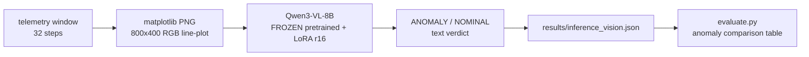
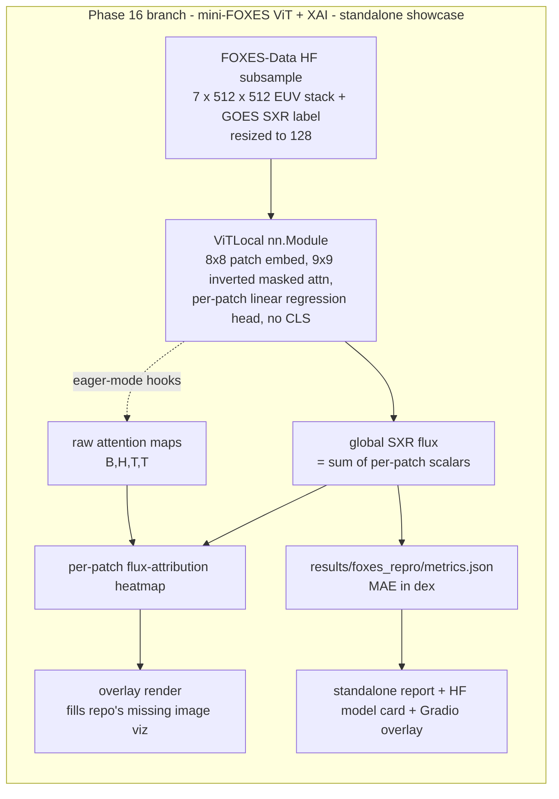

### Summary of change request

Phase 16 extends the repo with a Vision-Transformer + Explainable-AI showcase motivated by the **FOXES** problem (Goodwin et al. 2026): **maturing a published TRL-5 EUV→SXR-flux ViT toward a TRL-7/8 operational tool** — reproduce the model, integrate Surya-derived active-region masks as auxiliary inputs, and run catalog-scale historical inference. The capabilities to demonstrate are **Vision-Transformer construction** and **Explainable-AI (spatial attribution / attention)** depth — areas the repo's existing anomaly-detection work (production-MLOps plus fine-tuning frozen pretrained VLMs) does not exercise.

Gemini drafted a "Phase 16: ViT & XAI Extension" that would (a) instantiate a **mock** ViT block via `timm`/raw PyTorch, (b) register forward hooks on `nn.MultiheadAttention` to extract raw attention matrices, and (c) normalize those into saliency maps — with heavily-commented boilerplate using "high-level SciML terminology."

You were skeptical of the mock-and-boilerplate approach and asked for a second opinion: **can't we just rebuild the vision model as a real Vision Transformer instead?** This document is that second opinion. After your review + a feasibility-research pass, the decision is: **build a real, small, faithful miniature of FOXES on real EUV→SXR data, on a dedicated branch, reusing the repo's engineering discipline but NOT forcing it into the anomaly-detection comparison table.**

### Current State

- The repo's "vision" capability today is a **prompt-and-LoRA fine-tune of a pretrained VLM** (Qwen3-VL-8B) over single-panel RGB matplotlib line-plots of satellite telemetry. There is **no in-repo neural-network code at all** — a repo-wide search for `nn.Module`, `nn.MultiheadAttention`, `timm`, `patch_embed`, `ViT`, `torchvision` returns zero matches in `src/`. The transformer layers are entirely frozen pretrained weights; the repo owns only a LoRA config and the train/infer loops.
- So to a domain reviewer, the repo currently demonstrates **MLOps + LLM-adaptation skill, not computer-vision / ViT / XAI skill.** That is exactly the gap the committee is screening on.
- The repo's genuine strengths are real and rare: a disciplined **"own vs. adapt" comparison harness**, solid provenance (config snapshots, atomic writes, `--resume`/`--checkpoint-every`), `validate-*` gates, and a packaging surface (HF model/dataset cards, a Gradio Space, a Kaggle notebook).
- The public-facing surface has **no image / heatmap / overlay rendering anywhere** — the Gradio Space is two text boxes, and the only image-compositing code is the telemetry line-plot. There is no scientific-image (multi-channel tensor) data path; the project's data is ~31 GB tabular telemetry, not solar imagery.
- Operational constraint: the internal disk is nearly full; `DUAL DRIVE` is mounted; there's an existing Vast.ai cloud workflow.

### Desired End State

- The repo **undeniably demonstrates raw Vision-Transformer construction and Explainable-AI** on multi-channel scientific tensors — the two boxes the committee must check — through a small but **real, runnable, trained** artifact rather than mock boilerplate.
- The demonstration is **on the target scientific domain**: a faithful *miniature* of FOXES (multi-channel EUV input → GOES SXR flux, 8×8 patches, per-patch regression head, 9×9 inverted masked attention, raw attention extraction) trained on the FOXES authors' own published data, so a heliophysics reviewer immediately recognizes a faithful reproduction of the model, not just generic PyTorch-API familiarity.
- It lives on a **dedicated branch / standalone showcase** (its own report + HF-style model card + Gradio overlay), reusing the repo's provenance, `validate-*` gate, and matplotlib vocabulary — **narrative-aligned by engineering discipline, not by being shoehorned into the anomaly-detection scoreboard** (which would be apples-to-oranges).
- Scope is bounded to a **proof-of-mechanism miniature deliverable today/tomorrow**, honestly labeled — not a 1.4 TB / 2×A100 full reproduction.

### What we're not doing

- **Not** reproducing FOXES at full scale (1.4 TB dataset, 2×A100, 100 epochs, MAE 0.051 dex). This is a mechanism-faithful miniature, honestly labeled.
- **Not** shipping a mock model with random weights as if it were a result (the core disagreement with Gemini's draft — attention from untrained weights is noise).
- **Not** putting the FOXES regression into the CEF0.5 / Affinity-F1 anomaly-detection comparison table (different task, different metric — apples-to-oranges, explicitly excluded).
- **Not** touching the existing Qwen3-VL LoRA detector or the main-branch narrative — Phase 16 is additive and lives on its own branch.
- **Not** training Surya itself or fully wiring real AR masks (auxiliary-mask path is stubbed with a documented drop-in point).
- **Not** doing the telemetry-tensor ViT (Option B) unless the EUV data path fails — it's the documented fallback only.

### Proposed End State Architecture

**Before** (today's vision path — no in-repo network, no attention, no scientific tensor):



**After** (a real, small FOXES-faithful ViT on its own branch — separate from the anomaly table):



Core of the new module (pseudocode — the distinctive FOXES signature is the masked attention + per-patch head, *not* a CLS token; the public FOXES `vit_patch_model_local.py` is the reference to adapt + cite):

```python
class InvertedAttentionBlock(nn.Module):
    # 9x9 LOCAL neighborhood is BLOCKED -> every patch attends only to distant patches
    # (forces global context, the FOXES "non-local" mechanism). All 8 blocks use this.
    def forward(self, x, attn_mask):  # attn_mask precomputed from patch grid
        # nn.MultiheadAttention(need_weights=True, average_attn_weights=False)
        # OR timm attn with set_fused_attn(False) -> attention is materializable for XAI
        ...

class ViTLocal(nn.Module):
    def __init__(self, in_chans=7, patch=8, embed=256, depth=8, heads=8, mlp=1024):
        self.patch_embed = nn.Conv2d(in_chans, embed, kernel_size=patch, stride=patch)
        self.blocks = nn.ModuleList([InvertedAttentionBlock(...) for _ in range(depth)])
        self.mlp_head = nn.Sequential(nn.LayerNorm(embed), nn.Linear(embed, 1))  # per-patch scalar
    def forward(self, x):
        p = self.patch_embed(x).flatten(2).transpose(1, 2)   # (B, N_patches, 256)
        for blk in self.blocks: p = blk(p, self.mask)
        per_patch = self.mlp_head(p).squeeze(-1)             # (B, N) -> intrinsic attribution
        return per_patch.sum(1), per_patch                   # global SXR, spatial map
```

The intrinsic **per-patch attribution map** is the primary XAI artifact (it *is* the prediction, decomposed); **raw attention** extracted via eager-mode hooks is the secondary sanity-check — matching the paper's actual priority.

### Feasibility Research (2026-06-21)

Two web-research passes confirmed Option C is cheap, fast, and low-risk — which is what flipped the recommendation from "C as stretch goal" to "C as the primary deliverable."

**Data — the "fiddly EUV preprocessing" con is gone.** The FOXES authors publish [`griffingoodwin04/FOXES-Data`](https://huggingface.co/datasets/griffingoodwin04/FOXES-Data): **pre-paired** samples, each `aia_stack` `(7, 512, 512)` float32 normalized to `[-1,1]` (channels 94/131/171/193/211/304/335 Å) + `sxr_value` scalar (GOES XRSB W/m²) + ISO-timestamp `filename`. Already ITI-preprocessed (crop/degradation/normalize/resample) — steps 1–6 of the FOXES pipeline are skipped. The repo's `download/hugging_face_data_download.py` + `hf_download_config.yaml` expose `subsample_n` and use `load_dataset(streaming=True).take(n)`, so a 1,000-sample subset (~3.7 GB raw) downloads in ~10–30 min **without** pulling the full 1.46 TB. A PyTorch Lightning DataModule (`forecasting/data_loaders/SDOAIA_dataloader.py`) and the reference module (`forecasting/models/vit_patch_model_local.py`) ship in the repo. Resize 512²→128² with one `F.interpolate` at load. (SDOMLv2/Zenodo alternatives exist but lack SXR labels — would need manual SunPy/Fido GOES alignment, so they're inferior for a one-day build.)

**Compute — well under budget.** Vast.ai RTX A6000 (48 GB) ~$0.39–0.45/hr; RTX 4090 (24 GB, sufficient) ~$0.37/hr. A small ViT (N≈256 patches at 128², embed 256, 8 layers/heads, ~few-M params) on ~1–2k samples for 20–50 epochs is ~10–12 min pure train, **~$1–3 total** including spin-up, data pull (ingress free), and figures — could run 5–10 sweeps and stay under $25. Local **M3 Max** is viable at 128² (~2–4 hr) **but** has confirmed PyTorch-MPS bugs where `nn.MultiheadAttention` + masks (+dropout) yields NaNs (issue #151667) and no FlashAttention — and *we specifically use masked attention*, so cloud A6000/4090 is the safer, near-free choice.

### Design Questions

_All resolved — see "Resolved Design Questions" below._

### Resolved Design Questions

#### DQ1 — Real (trained) model, not a mock — **RESOLVED: Option B (real small trained model)**

A genuine `nn.Module` ViT trained to a real (if modest) result, with attribution maps that correspond to learned structure. **Rationale:** a small *real* artifact beats a large *mock* one for a domain-scientist audience; attention from random weights is meaningless and reviewers who read code see through it instantly — the mock is the one move almost guaranteed to backfire. (You: "agreed.")

_Not chosen — Option A (mock ViT + boilerplate):_ fastest to write and touches the hook APIs, but produces meaningless saliency from untrained weights and reads as keyword-stuffing. Discarded as a credibility risk with the exact audience we're trying to impress.

#### DQ2 — Substrate/task — **RESOLVED: Option C (real EUV→SXR mini-FOXES) as the primary deliverable, on a dedicated branch; Option B retained only as a fallback**

Feasibility research (above) removed C's only real con: the data is pre-paired and one command away, and the GPU run is ~$1–3. So we build a faithful miniature of FOXES on real solar data. **Rationale:** it's the single most on-target artifact possible (it reproduces the actual model the job is about), and it is now also one of the *easiest* paths — a rare win-win. (You: "if C is feasible within constraints, go with C; otherwise B.")

**Why C fits the repo narrative without faking the scoreboard — in plain terms.** Think of the repo as a portfolio with one clear story: *"give me a satellite-telemetry monitoring problem and I'll build several kinds of AI for it and rigorously compare them on one scoreboard."*
- **Option B** is like adding a new player to that *same* game: a hand-built ViT that competes on the telemetry-anomaly scoreboard next to the LSTM and the LLMs. It *belongs* on the existing table — but to make a "vision transformer" play a telemetry game you must pretend the telemetry is an image, which is a little artificial, and it still isn't the thing the FOXES job actually does.
- **Option C** is like building a small working replica of the *exact machine the new job is about* (sun images → X-ray flux). It's a different game with a different scoreboard (you measure error in flux "dex," not anomaly precision). You **can't** put it on the old scoreboard — that's the apples-to-oranges you (correctly) ruled out. So it lives in its own room: a **separate branch**, clearly labeled "this is me reproducing your model."
- **How we keep it narrative-aligned anyway:** C reuses *all* the repo's engineering DNA — the same provenance (config snapshots, atomic writes, `--resume`), the same `validate-*` gate style, the same matplotlib look, the same "report + model card" packaging. So it reads as *"same engineer, same rigor, new domain"* — which is precisely the leap the job asks for (telemetry-MLOps person → heliophysics-ViT person). It's a bridge, not a non-sequitur.

_Not chosen as primary — Option B (telemetry-tensor ViT):_ better-aligned with the *main* narrative and needs no new data, but it's off-domain for the job and visually less compelling; kept as the documented fallback if the HF download somehow fails. _Option A (line-plots):_ rejected — a ViT over a picture of a line is scientifically pointless.

#### DQ3 — Primary XAI mechanism — **RESOLVED: Option B (per-patch regression-head attribution primary, raw attention secondary)**

The per-patch flux map is the headline XAI artifact; raw attention (eager-mode, **no rollout**) is the secondary sanity-check, exactly as the paper does. **Rationale:** faithful to FOXES, and intrinsic attribution (the decomposed prediction) is a stronger XAI story than post-hoc saliency. (You: "agreed.")

_Not chosen — Option A (attention rollout primary, Gemini's focus):_ it's the *wrong* mechanism for this baseline — the paper deliberately avoids rollout/Grad-CAM, so leading with it signals not having read FOXES closely.

#### DQ4 — Faithful reproduction vs. generic ViT — **RESOLVED: Option B (from-scratch `ViTLocal`, `timm` only for plumbing)**

Implement the 9×9 inverted masked-attention block + no-CLS per-patch head ourselves (adapting + citing the public FOXES `vit_patch_model_local.py`), using `timm`/`nn` primitives only for patch-embed plumbing and multi-channel adaptation. **Rationale:** the masked-attention mask construction and per-patch summation are exactly the "raw transformer layer manipulation" the committee wants to see; must keep the eager-attention path (`set_fused_attn(False)` / `attn_implementation="eager"`) so attention is materializable. (You: "agreed.")

_Not chosen — Option A (generic `timm` ViT):_ one-line instantiate, but misses the two distinctive FOXES signatures (masked attention, per-patch head), so it wouldn't prove understanding of *this* model.

#### DQ5 — Surya AR masks — **RESOLVED: Option B (stub + documented drop-in for v1)**

Wire an optional `aux_mask` input path through the module (extra `in_chans` / additive attention prior), demonstrate on a placeholder mask, and document exactly how the real SuryaBench AR masks (1.31 GB HDF5 on HF) attach. **Rationale:** demonstrates understanding of the named integration point and the foundation-model ecosystem without the data lift that would blow the deadline. (You: "agreed.")

_Not chosen for v1 — Option A (real AR-mask integration):_ hits the third competency directly but adds resolution/cadence-alignment work; flagged as the obvious next step.

#### DQ6 — Data & compute — **RESOLVED: FOXES-Data HF subsample (~1–2k samples, ~3.7 GB) trained on Vast.ai RTX A6000/4090**

Use the pre-paired FOXES-Data subsample (DQ2/Feasibility); train on the existing Vast.ai cloud workflow (A6000 ~$0.40/hr or 4090 ~$0.37/hr), keeping it off the full local disk. **Rationale:** total ~$1–3 (well under the $25–50 ceiling) and ~hours not days; `DUAL DRIVE` is mounted but cloud is cleaner and avoids the M3-MPS masked-attention NaN bug. (You: "the dual drive is mounted, but do Vast.ai A6000 if it doesn't break the bank — <$25–50 great." → confirmed ~$1–3.)

_Not chosen:_ SDOMLv2/Zenodo subsets (no SXR labels → manual GOES alignment); local M3 Max (MPS masked-attention NaNs, slower) — kept as an emergency-only fallback.

#### DQ7 — Showcase surface — **RESOLVED: standalone report + HF-style model card + Gradio overlay, NOT the comparison table; on a dedicated branch/worktree**

Land metrics in `results/foxes_repro/metrics.json` (MAE in dex) with its own report section + model card, and add the **per-patch flux-attribution heatmap overlay** (the image rendering the repo currently lacks) in the repo's matplotlib vocabulary (`#1f77b4`, `alpha=0.3`, Agg, `dpi=120`), surfaced in a small Gradio view. Reuse the harness/provenance/`validate-*` machinery. **Rationale:** it's a regression task, so forcing it into the CEF0.5/Affinity-F1 table would be apples-to-oranges (explicitly ruled out); a separate branch lets it showcase a different-from-main-narrative capability cleanly. (You: "don't compare apples to oranges; we can create a separate worktree/branch to showcase something different from the main narrative.")

#### DQ8 — Scope & deadline — **RESOLVED: minimum credible v1, delivered today or tomorrow**

v1 = real `ViTLocal` (masked attention + per-patch head) + FOXES-Data subsample + a short training run to a *modest but real* MAE + per-patch attribution heatmap overlay + attention-extraction sanity figure + standalone report/model card + `validate-foxes` gate + full provenance. Surya masks **stubbed** (DQ5). Full-resolution / full-dataset / real Surya integration / catalog-scale inference are explicit "next steps." **Rationale:** the interview process is active and the job starts Jun 29, so a focused, honestly-labeled proof-of-mechanism shipped now beats a larger thing shipped late. (You: "target done today or latest tomorrow; go with the recommendation; align with the narrative where possible but don't compare apples to oranges.")

### Patterns to follow

These are existing repo patterns the new branch should reuse (from the research doc), plus the external technique caveats.

#### Provenance: config snapshot + atomic write + resume

Every result JSON embeds `config: vars(args)`, writes atomically, and supports resume. The mini-FOXES training/inference must do the same.

```python
# existing pattern (eval_vision.py / train_lstm.py)
tmp = out_path.with_suffix(".tmp")
tmp.write_text(json.dumps({"config": vars(args) | {...}, "summary": {...}, "results": [...]}))
os.replace(tmp, out_path)   # atomic
# --resume rebuilds a `done` set of completed keys; --checkpoint-every default 250
```

```python
# Phase 16: ViT training checkpoints + inference results follow the identical shape
torch.save({"model": model.state_dict(), "config": vars(args), "epoch": e}, tmp); os.replace(tmp, ckpt)
```

#### Eager attention is mandatory for XAI extraction

Fused / SDPA / FlashAttention **do not materialize** the attention matrix. This is the single most common failure mode for attention-map XAI (and the M3-MPS NaN bug compounds it for masked attention — another reason to train on cloud CUDA).

```python
import timm
timm.layers.set_fused_attn(False)          # BEFORE create_model
# or nn.MultiheadAttention(..., need_weights=True, average_attn_weights=False)
# or HF: attn_implementation="eager", output_attentions=True
from timm.utils import AttentionExtract     # returns {layer: (B, H, N, N)}
```

#### Multi-channel patch embedding (`in_chans>3`)

For a from-scratch `ViTLocal` the `nn.Conv2d(in_chans, embed, patch, patch)` is trained fresh on the 7 EUV channels — no weight adaptation needed. (`timm`'s `adapt_input_conv` repeat→slice→scale is only relevant if borrowing pretrained RGB weights, and it can't adapt *from* >3-channel sources.)

#### Standalone report + model card packaging (not the comparison harness)

`evaluate.py` aggregates the *anomaly* task; the FOXES regression deliberately does **not** plug in there (DQ7). Instead mirror the existing model-card pattern (`huggingface/qwen3-vl-8b-detection_MODELCARD.md`) with a `model-index` of regression metrics (MAE/RMSE/Pearson r in dex) for a separate "FOXES reproduction" card.

#### `validate-*` Makefile gate

Correctness is enforced by inline-Python `assert` gates, not pytest. Add `validate-foxes` in the same style (metrics finite, no `error` key, and the key faithfulness check: **per-patch attribution map sums ≈ global prediction**).

#### matplotlib visualization vocabulary

Consistent across the repo: `#1f77b4`, `alpha=0.3` fills, Agg backend, `figsize=(6,5)`/`(8,4)`, `dpi=120`/`100`, `bbox_inches="tight"`. The new flux-attribution-heatmap overlay should match this so figures look native — and it fills the documented gap that **no image/heatmap/overlay rendering exists anywhere today**.
